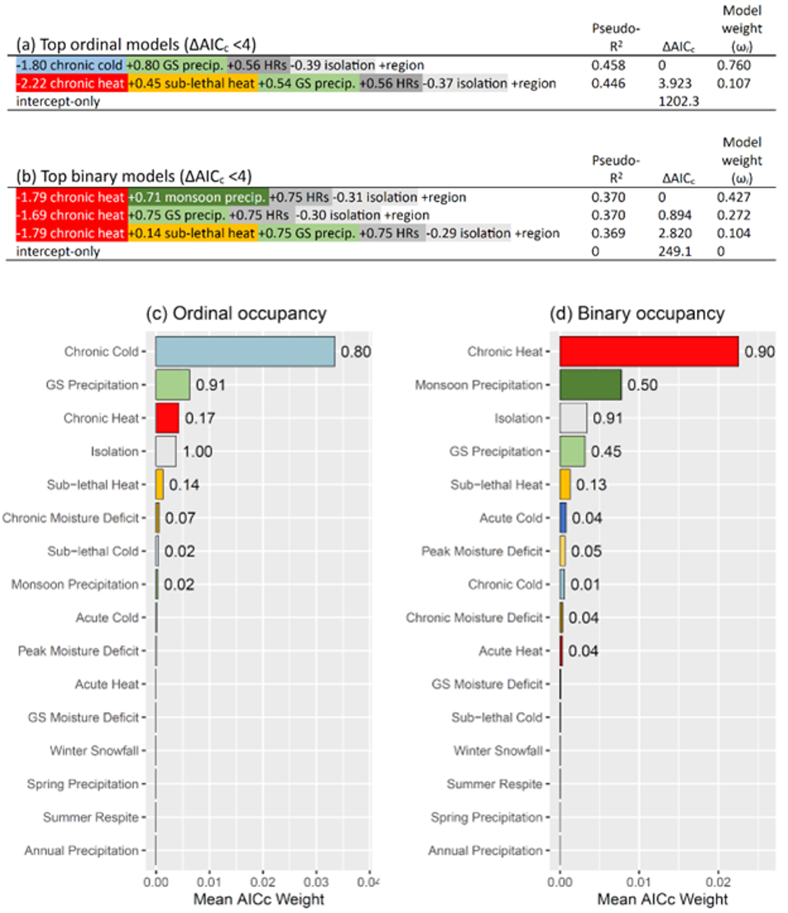
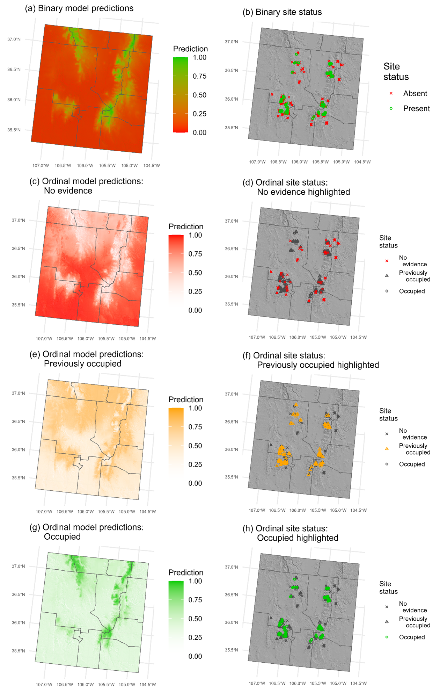

# pika_newMexico_2016through2020
This repository contains scripts for:

Beever, E.A., Westover, M., Smith, A.B., Gerraty, F., Billman, P., and Smith, F. *Accepted*. Combining past and contemporary species occurrences with ordinal species distribution modeling to investigate responses to climate change. *Ecography*.

*Abstract*. Many organisms leave evidence of their former occurrence, such as scat, abandoned burrows, middens, ancient eDNA, or fossils, which indicate areas from which a species has since disappeared. However, combining this evidence with contemporary occurrences within a single modeling framework remains challenging. Traditional binary species-distribution modeling reduces occurrence to two temporally coarse states (present/absent), so thus cannot leverage the information inherent in temporal sequences of evidence of past occurrence. In contrast, ordinal modeling can use the natural time-varying order of states (e.g., never occupied vs. previously occupied vs. currently occupied) to provide greater insights into range shifts. We demonstrate the power of ordinal modeling for identifying the major influences of biogeographic and climatic variables on current and past occupancy of the American pika (*Ochotona princeps*), a climate-sensitive mammal. Sampling over 5 years across the species’ southernmost, warm-edge range limit, we tested the effects of these variables at 570 habitat patches where occurrence was classified either as binary or ordinal. The two analyses produced different top models and predictors – ordinal modeling highlighted chronic cold as the most-important predictor of occurrence, whereas binary modeling indicated primacy of average summer-long temperatures. Colder wintertime temperatures were associated in ordinal models with higher likelihood of occurrence, which we hypothesize reflect longer retention of insulative and meltwater-provisioning snowpacks. Our binary results mirrored those of other past pika investigations employing binary analysis, wherein warmer temperatures decrease likelihood of occurrence. Because both ordinal- and binary-analysis top models included climatic and biogeographic factors, results constitute important considerations for climate-adaptation planning. Cross-time evidences of species occurrences remain underutilized for assessing responses to climate change. Compared to multi-state occupancy modeling, which presumes all states occur in the same time period, ordinal models enable use of historical evidence of species' occurrence to identify factors driving species’ distributions more finely across time.

**Differences in inferences between ordinal and binary species distribution models** Top-ranked models (ΔAICc<4) for **a)** ordinal occupancy, and **b)** binary occupancy. "HRs" denotes number of home ranges that a patch could potentially support. "GS" = growing-season. Inclusion of the variable "region" indicates that occupancy differed significantly among sub-regions in a given model; it appeared in all top models. The variable "isolation" reflects mean distance to the nearest four patches from each focal patch. We used Nagelkerke’s R2 to calculate pseudo-R2 (Nagelkerke 1991). "Model Weight" = AICc-based model weight. Note that R2 values can only be meaningfully compared within the same model structure. Variable importance in information-theoretic analyses of **c)** ordinal occupancy, and **d)** binary occupancy. Width of each horizontal bar represents average AICc (model) weight for the models in which each variable appears (i.e., summed variable weight/number of models). Values on the right of each bar represent that predictor's variable weight (i.e., the sum of the weight of all models in which the predictor appears).

**Differences in predictions between ordinal and binary species distribution models** Spatial predictions for the current period of binary (a) and ordinal (c, e, g) models. To aid visual comparison, survey sites and their status are displayed in the right-hand column.
