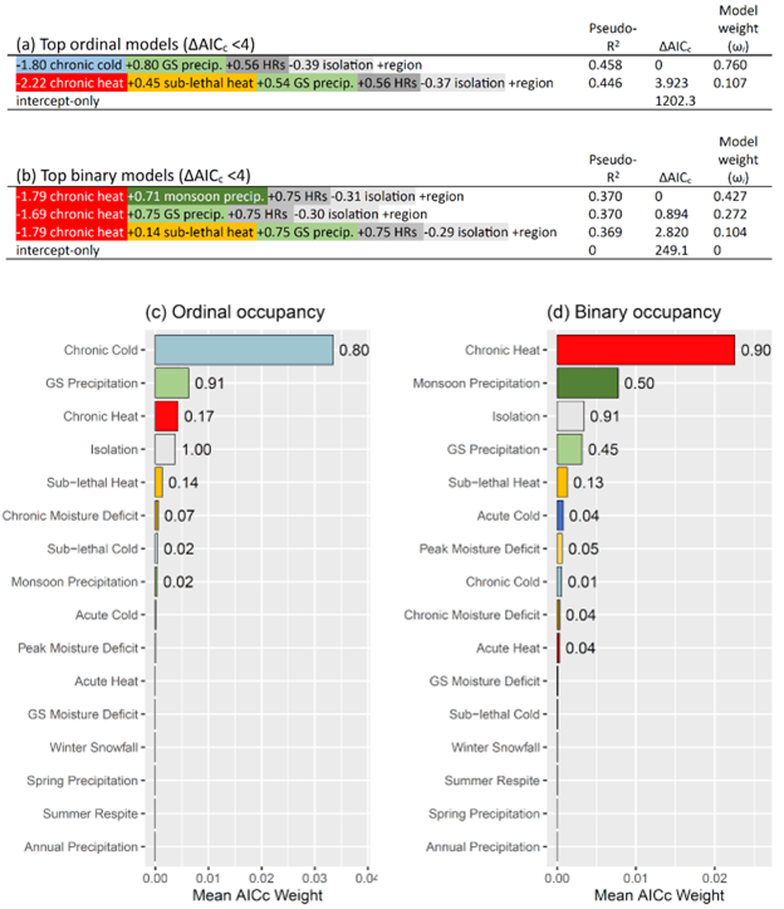
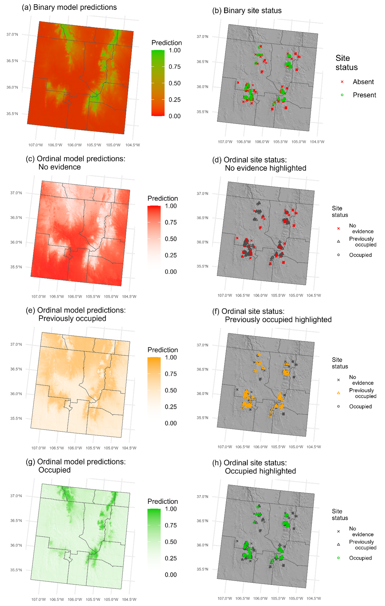

# pika_newMexico_2016through2020
This repository contains scripts for the following peer-reviewed articles:

**[Beever, E.A., Westover, M., Smith, A.B., Gerraty, F., Billman, P., and Smith, F. 2025. Combining past and contemporary species occurrences with ordinal species distribution modeling to investigate responses to climate change. *Ecography* 2025:e07382](https://doi.org/10.1111/ecog.07382)**

*Abstract*. Many organisms leave evidence of their former occurrence, such as scat, abandoned burrows, middens, ancient eDNA, or fossils, which indicate areas from which a species has since disappeared. However, combining this evidence with contemporary occurrences within a single modeling framework remains challenging. Traditional binary species-distribution modeling reduces occurrence to two temporally coarse states (present/absent), so thus cannot leverage the information inherent in temporal sequences of evidence of past occurrence. In contrast, ordinal modeling can use the natural time-varying order of states (e.g., never occupied vs. previously occupied vs. currently occupied) to provide greater insights into range shifts. We demonstrate the power of ordinal modeling for identifying the major influences of biogeographic and climatic variables on current and past occupancy of the American pika (*Ochotona princeps*), a climate-sensitive mammal. Sampling over 5 years across the species’ southernmost, warm-edge range limit, we tested the effects of these variables at 570 habitat patches where occurrence was classified either as binary or ordinal. The two analyses produced different top models and predictors – ordinal modeling highlighted chronic cold as the most-important predictor of occurrence, whereas binary modeling indicated primacy of average summer-long temperatures. Colder wintertime temperatures were associated in ordinal models with higher likelihood of occurrence, which we hypothesize reflect longer retention of insulative and meltwater-provisioning snowpacks. Our binary results mirrored those of other past pika investigations employing binary analysis, wherein warmer temperatures decrease likelihood of occurrence. Because both ordinal- and binary-analysis top models included climatic and biogeographic factors, results constitute important considerations for climate-adaptation planning. Cross-time evidences of species occurrences remain underutilized for assessing responses to climate change. Compared to multi-state occupancy modeling, which presumes all states occur in the same time period, ordinal models enable use of historical evidence of species' occurrence to identify factors driving species’ distributions more finely across time.

**Differences in inferences between ordinal and binary species distribution models.** Top-ranked models (ΔAICc<4) for **a)** ordinal occupancy, and **b)** binary occupancy. "HRs" denotes number of home ranges that a patch could potentially support. "GS" = growing-season. Inclusion of the variable "region" indicates that occupancy differed significantly among sub-regions in a given model; it appeared in all top models. The variable "isolation" reflects mean distance to the nearest four patches from each focal patch. We used Nagelkerke’s R2 to calculate pseudo-R2 (Nagelkerke 1991). "Model Weight" = AICc-based model weight. Note that R2 values can only be meaningfully compared within the same model structure. Variable importance in information-theoretic analyses of **c)** ordinal occupancy, and **d)** binary occupancy. Width of each horizontal bar represents average AICc (model) weight for the models in which each variable appears (i.e., summed variable weight/number of models). Values on the right of each bar represent that predictor's variable weight (i.e., the sum of the weight of all models in which the predictor appears).

**Differences in predictions between ordinal and binary species distribution models.** Spatial predictions for the current period of binary (a) and ordinal (c, e, g) models. To aid visual comparison, survey sites and their status are displayed in the right-hand column.

# Workflow
All relevant code files are named with numbers indicating the order in which they should be run to complete the analysis.

1. **00 New Mexico Pika Occupancy & Abundance Analysis - Shared Functions & Constants.r**
	- Initializes shared settings, constants, package imports, color schemes, and helper functions used by downstream scripts.
	- Provides reusable modeling utilities (for example, variable naming helpers, PRISM extraction helpers, and model-support functions) that are sourced by most later files.
    - Called by all subsequent code files.

2. **01 New Mexico Pika Occupancy & Abundance Analysis - Process Data.r**
	- Cleans and standardizes raw pika survey records, harmonizes occupancy and density fields across years, and performs site-level corrections.
	- Builds derived climate/environmental predictors (including PRISM-based variables), defines regions/folds, and writes prepared analysis datasets used by modeling and summary scripts.

3. **02 New Mexico Pika Occupancy & Abundance Analysis - Maps.r**
	- Produces mapping products for the study system (sampling-site maps, occupancy-status maps, elevation/hillshade context, and related geographic visuals).
	- Uses processed site/environment data from earlier steps to create figures that support interpretation of later model outputs.

4. **03a New Mexico Pika Occupancy & Abundance Analysis - Occupancy with Simple Models.r**
	- Runs occupancy modeling with simple model sets, including both ordinal and binary formulations, model ranking, variable importance, predictions, and cross-validation products.
	- Consumes cleaned and derived predictors from previous steps and generates core occupancy inference tables/figures later summarized in reporting scripts.

5a. **03a New Mexico Pika Occupancy & Abundance Analysis - Occupancy with Simple Models - Accounting for Spatial Redundancies.r**
	- Repeats the occupancy modeling framework while accounting for shared PRISM-cell redundancy via weighting.
	- Serves as a sensitivity/robustness counterpart to the main 03a occupancy analysis to evaluate how spatial non-independence affects inference.

5b. **03a New Mexico Pika Occupancy & Abundance Analysis - Occupancy with Simple Models - Accounting for Spatial Autocorrelation.r**
	- Similar to the script above, repeats the occupancy modeling framework while accounting for spatial autocorrelation using a kriging term.
	- Serves as a sensitivity/robustness counterpart to the main 03a occupancy analysis to evaluate how spatial non-independence affects inference.

6. **03b New Mexico Pika Occupancy & Abundance Analysis - Density with Simple Models.r**
	- Fits density models for occupied sites (Gamma GLMs), compares climate/biogeographic/management model sets, and computes predictor importance.
	- Complements occupancy analyses by modeling abundance patterns where pikas are present, enabling side-by-side interpretation of occupancy vs. density drivers.

7. **03c Univariate Occupancy and Density Models.r**
	- Fits univariate standardized-coefficient models for occupancy and density predictors.
	- Provides effect-size-oriented checks that complement multi-predictor model-selection outputs from 03a and 03b.

8. **04 Summaries.r**
	- Produces synthesis outputs such as occupancy counts by region, elevation summaries, extent-of-occurrence calculations, variable-importance visual summaries, and distributional/statistical comparisons.
	- Integrates and reports results from prior processing/modeling scripts into manuscript-ready summary tables and figures.

9. **05 Data Collation for Publication.r**
	- Assembles and renames cleaned site-level fields and selected climate predictors into publication-ready data tables.
	- Translates internal analysis objects into externally shareable outputs for manuscripts/data release.

10. **06 Analysis of Occurrence vs Microclimate.r**
	 - Performs dedicated microclimate analyses (single-year and multi-year), including exploratory analyses, variable-correlation checks, and occurrence modeling workflows.
	 - Extends the main occupancy/density pipeline with focused microclimate inference and generates additional targeted figures/tables.

